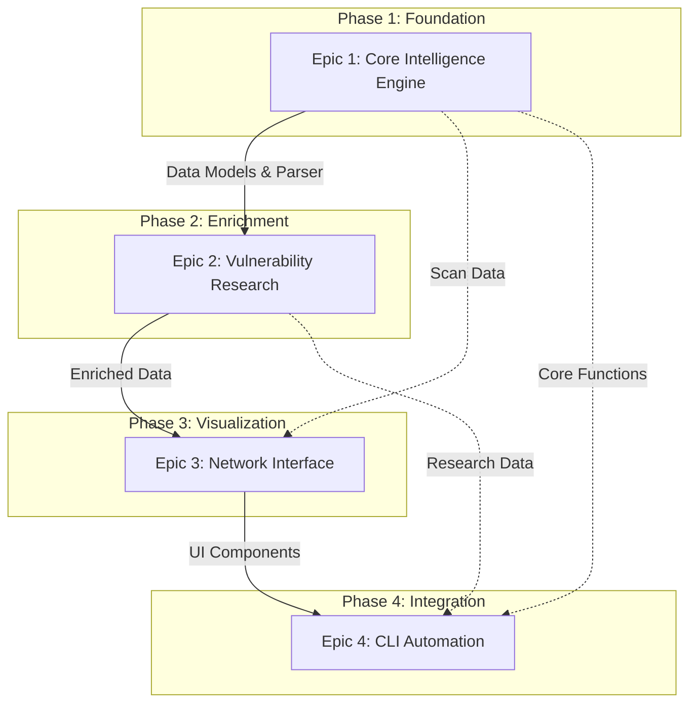

# Epic Dependencies and Execution Order

## Executive Summary

This document explicitly defines the cross-epic dependencies and execution sequence for the Hermes project, addressing the critical blocking issue identified in the PO validation report.

## Mandatory Execution Sequence

## Detailed Dependency Matrix

| Epic | Depends On | Provides To | Critical Dependencies |
|------|------------|-------------|----------------------|
| Epic 1 | None (Foundation) | Epic 2, 3, 4 | Database schema, Parser logic, Data models |
| Epic 2 | Epic 1 | Epic 3, 4 | Vulnerability data, Research results, API framework |
| Epic 3 | Epic 1, 2 | Epic 4 | Visualization components, Export logic, UI patterns |
| Epic 4 | Epic 1, 2, 3 | End Users | CLI interface, Workflow automation, Integration layer |

## Epic 1 → Epic 2 Dependencies

### Required from Epic 1:
1. **Data Models**
   - Host entity structure
   - Service entity structure
   - Scan metadata model
   - Database relationships

2. **Parser Output**
   - Structured scan data
   - Service version information
   - Banner text extraction
   - Host/service relationships

3. **Infrastructure**
   - Database connection layer
   - Repository pattern
   - API framework setup
   - Background job infrastructure

### Blocking Points:
- Epic 2 CANNOT start vulnerability analysis without Epic 1's service parsing
- Epic 2 CANNOT store research results without Epic 1's database schema
- Epic 2 CANNOT process data without Epic 1's infrastructure

## Epic 2 → Epic 3 Dependencies

### Required from Epic 2:
1. **Enriched Data**
   - Vulnerability severity scores
   - CVE associations
   - Risk assessments
   - Research status flags

2. **API Infrastructure**
   - Research service endpoints
   - WebSocket connections
   - Real-time update mechanisms
   - Caching layer

### Blocking Points:
- Epic 3 CANNOT color-code by severity without Epic 2's CVSS scores
- Epic 3 CANNOT show vulnerability details without Epic 2's research
- Epic 3 CANNOT display real-time updates without Epic 2's WebSocket setup

## Epic 3 → Epic 4 Dependencies

### Required from Epic 3:
1. **Export Capabilities**
   - Graph export functions
   - Markdown generation logic
   - Report formatting

2. **Display Logic**
   - Data presentation patterns
   - Filtering mechanisms
   - Summary generation

### Integration Points:
- Epic 4 MAY reuse Epic 3's export functions for CLI output
- Epic 4 MAY leverage Epic 3's display logic for terminal UI
- Epic 4 SHOULD maintain consistency with Epic 3's data presentation

## Critical Path Timeline

### Phase 1: Foundation (Weeks 1-3)
**Epic 1 Completion Required**
- Week 1: Infrastructure setup (US-1.1)
- Week 2: Data models and schema (US-1.2)
- Week 3: Parser implementation (US-1.3, US-1.4)
- **Gate**: Parser must successfully process nmap files

### Phase 2: Enrichment (Weeks 4-6)
**Epic 2 Completion Required**
- Week 4: Service analysis (US-2.1)
- Week 5: API infrastructure (US-2.2)
- Week 6: NVD integration (US-2.3)
- **Gate**: Vulnerability research must return results

### Phase 3: Visualization (Weeks 7-9)
**Epic 3 Completion Required**
- Week 7: Basic graph generation (US-3.1)
- Week 8: Interface layout (US-3.3)
- Week 9: Integration and testing
- **Gate**: Graph must display enriched data

### Phase 4: Integration (Weeks 10-11)
**Epic 4 Completion Required**
- Week 10: CLI tool development (US-4.1)
- Week 11: Integration testing
- **Gate**: End-to-end workflow must function

## Dependency Resolution Strategy

### Parallel Work Opportunities

While epics have sequential dependencies, some parallel work is possible:

1. **Within Epic 1**:
   - Frontend scaffolding (US-1.1) parallel with backend
   - Documentation templates while parser develops

2. **Epic 2 Preparation**:
   - API key management UI can start during Epic 1
   - Research service scaffolding can begin early

3. **Epic 3 Preparation**:
   - UI mockups and design during Epic 1/2
   - D3.js prototypes with sample data

4. **Epic 4 Preparation**:
   - CLI framework setup during Epic 2/3
   - Help documentation writing

### Dependency Mitigation

1. **Mock Data Strategy**:
   - Create mock data generators for each epic
   - Allow UI development with simulated data
   - Enable parallel testing

2. **Interface Contracts**:
   - Define API contracts early
   - Use OpenAPI specifications
   - Generate client/server stubs

3. **Integration Testing**:
   - Continuous integration between epics
   - Daily builds with all components
   - Automated dependency validation

## Risk Management

### High-Risk Dependencies

1. **Parser Output Format** (Epic 1 → 2, 3)
   - Risk: Format changes break downstream
   - Mitigation: Versioned data contracts
   - Fallback: Adapter pattern for changes

2. **Research Data Availability** (Epic 2 → 3)
   - Risk: API failures leave no data
   - Mitigation: Fallback to basic display
   - Fallback: Manual research links

3. **Graph Performance** (Epic 3 → 4)
   - Risk: Large graphs block CLI
   - Mitigation: Pagination and filtering
   - Fallback: Text-only output option

### Dependency Validation Checklist

Before starting each epic:

#### Epic 2 Start Checklist:
- [ ] Epic 1 parser successfully processes nmap files
- [ ] Database schema supports vulnerability data
- [ ] Service version extraction working
- [ ] API framework operational

#### Epic 3 Start Checklist:
- [ ] Epic 2 returns vulnerability data
- [ ] Research APIs configured and tested
- [ ] Severity scoring implemented
- [ ] WebSocket infrastructure ready

#### Epic 4 Start Checklist:
- [ ] Epic 3 graph generation working
- [ ] Export functions implemented
- [ ] All core features accessible via API
- [ ] Documentation generation complete

## Conclusion

This dependency management plan ensures:
- ✅ Clear sequential execution path
- ✅ Explicit blocking dependencies identified
- ✅ Risk mitigation strategies defined
- ✅ Validation gates between phases
- ✅ Parallel work opportunities maximized

Following this plan prevents the integration failures and development blocking identified in the PO validation report.
