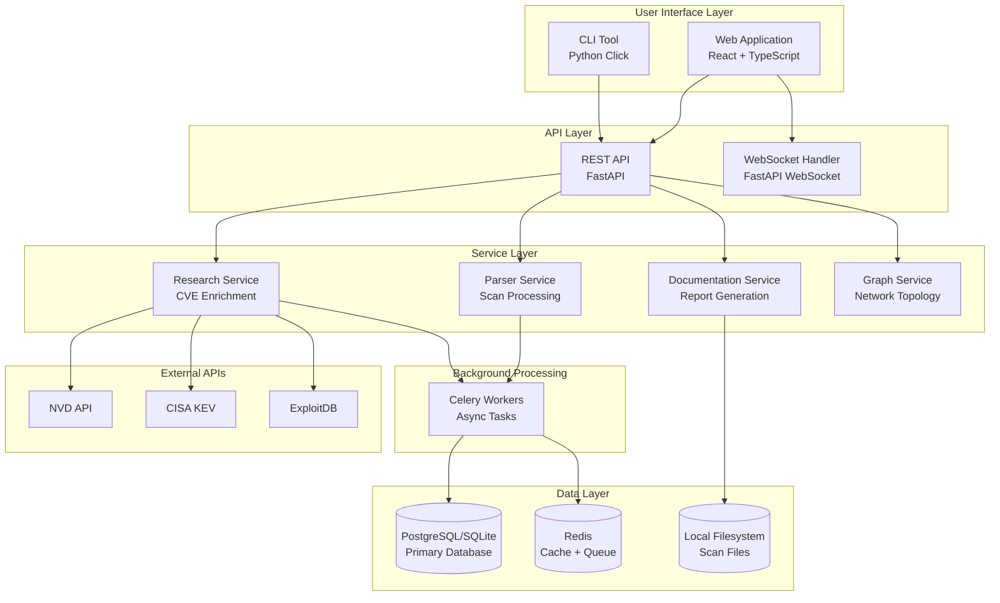

# High Level Architecture

## Technical Summary
Hermes employs a service-oriented architecture within a monorepo structure, balancing modularity with deployment simplicity. The system prioritizes immediate value delivery through intelligent automation while maintaining flexibility for future enterprise evolution.

## Platform Choice
**Self-Hosted Docker Deployment**
- Docker Compose orchestration for simplicity
- No external cloud dependencies for security compliance
- Local-first data processing
- Optional air-gap deployment capability

## Repository Structure
**Monorepo Architecture**
```
hermes/
├── backend/
│   ├── api/
│   ├── services/
│   │   ├── parser/
│   │   ├── research/
│   │   └── documentation/
│   ├── models/
│   ├── repositories/
│   └── workers/
├── frontend/
│   └── web-app/
├── cli/
│   └── hermes-cli/
├── shared/
│   ├── types/
│   └── database/
└── infrastructure/
    ├── docker/
    └── scripts/
```

## Architecture Diagram



## Architectural Patterns
- **Service-Oriented Architecture**: Logical separation without deployment complexity
- **Repository Pattern**: Clean data access abstraction
- **Factory Pattern**: Extensible scan parser system
- **Event-Driven Processing**: Background tasks for heavy operations
- **Progressive Enhancement**: Simple MVP to team collaboration
