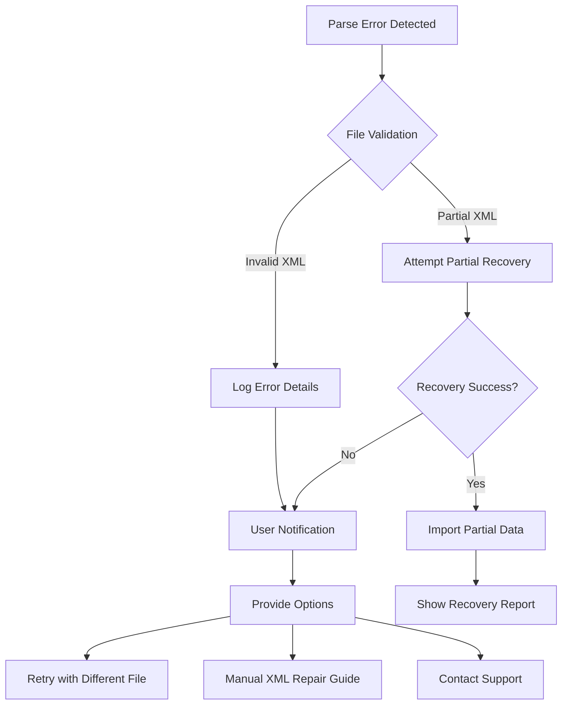
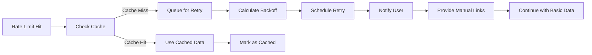

# Error Recovery Workflows

## Executive Summary

This document defines comprehensive error handling and recovery workflows for all critical failure scenarios in the Hermes platform, addressing the PO validation feedback regarding missing error recovery details.

## Error Categories and Severity Levels

### Severity Levels
- **CRITICAL**: System cannot continue, data loss possible
- **ERROR**: Operation failed, but system stable
- **WARNING**: Degraded functionality, but operational
- **INFO**: Notable events, no action required

## Scan Parsing Error Workflows

### Scenario 1: Corrupted or Invalid XML File

**Error Type**: ERROR
**Detection**: XML parser throws exception
**User Impact**: Cannot import scan results

**Recovery Workflow**:


**Implementation Details**:
1. **Immediate Response**:
   - Capture full error stack trace
   - Save original file for debugging
   - Generate error ID for tracking

2. **User Notification**:
   ```
   ERROR: Failed to parse scan file
   File: scan_results.xml
   Error: Malformed XML at line 1523
   Error ID: ERR-PARSE-001
   
   Options:
   [1] Try partial recovery (may lose some data)
   [2] View XML repair guide
   [3] Select different file
   [4] Skip this file
   ```

3. **Partial Recovery Logic**:
   - Attempt to parse valid sections
   - Skip corrupted blocks
   - Log skipped sections
   - Generate recovery report

### Scenario 2: Unsupported Scan Format

**Error Type**: WARNING
**Detection**: File type not recognized
**User Impact**: Cannot process specific scan type

**Recovery Workflow**:
```python
def handle_unsupported_format(file_path):
    # 1. Identify actual format
    detected_format = detect_file_format(file_path)
    
    # 2. Check for similar supported formats
    similar_formats = find_similar_formats(detected_format)
    
    # 3. Provide conversion options
    if similar_formats:
        return {
            "status": "warning",
            "message": f"Format {detected_format} not supported",
            "suggestions": [
                f"Convert to {fmt}" for fmt in similar_formats
            ],
            "conversion_guide": get_conversion_guide(detected_format)
        }
    
    # 4. Fallback to manual entry
    return {
        "status": "warning",
        "message": "Unsupported format",
        "action": "manual_entry",
        "template": get_manual_entry_template()
    }
```

### Scenario 3: Memory/Performance Issues with Large Scans

**Error Type**: ERROR
**Detection**: Memory usage > 80% or processing timeout
**User Impact**: System becomes unresponsive

**Recovery Workflow**:

1. **Automatic Chunking**:
   ```python
   def process_large_scan(file_path, chunk_size=100):
       try:
           # Attempt normal processing
           return parse_scan_file(file_path)
       except MemoryError:
           # Switch to chunked processing
           return process_in_chunks(file_path, chunk_size)
   ```

2. **Progressive Loading**:
   - Parse file in segments
   - Process each segment independently
   - Aggregate results incrementally
   - Show progress to user

3. **User Options**:
   - Reduce processing scope (specific IP ranges)
   - Export partial results
   - Schedule background processing

## API Integration Error Workflows

### Scenario 4: NVD API Rate Limit Exceeded

**Error Type**: WARNING
**Detection**: HTTP 429 response
**User Impact**: No vulnerability enrichment

**Recovery Workflow**:



**Implementation**:
```python
class NVDRateLimitHandler:
    def handle_rate_limit(self, cve_id):
        # 1. Check cache first
        cached = self.cache.get(cve_id)
        if cached:
            return {"source": "cache", "data": cached}
        
        # 2. Calculate exponential backoff
        retry_after = self.calculate_backoff()
        
        # 3. Queue for background retry
        self.queue_for_retry(cve_id, retry_after)
        
        # 4. Return manual research links
        return {
            "source": "manual",
            "links": [
                f"https://nvd.nist.gov/vuln/detail/{cve_id}",
                f"https://cve.mitre.org/cgi-bin/cvename.cgi?name={cve_id}"
            ],
            "retry_scheduled": retry_after
        }
```

### Scenario 5: External API Unavailable

**Error Type**: WARNING
**Detection**: Connection timeout or 5xx errors
**User Impact**: Degraded research capabilities

**Recovery Workflow**:

1. **Fallback Cascade**:
   ```python
   research_sources = [
       ("nvd", query_nvd_api),
       ("cisa", query_cisa_kev),
       ("local_db", query_local_database),
       ("manual_links", generate_research_links)
   ]
   
   def research_vulnerability(cve_id):
       for source_name, source_func in research_sources:
           try:
               result = source_func(cve_id)
               if result:
                   return {
                       "source": source_name,
                       "degraded": source_name != "nvd",
                       "data": result
                   }
           except APIException:
               continue
       
       return {"source": "none", "manual_required": True}
   ```

2. **User Notification**:
   - Show degraded mode indicator
   - Explain which features affected
   - Provide timeline for retry
   - Offer manual alternatives

## Database Error Workflows

### Scenario 6: Database Connection Lost

**Error Type**: CRITICAL
**Detection**: Connection timeout or refused
**User Impact**: Complete system failure

**Recovery Workflow**:

```python
class DatabaseRecoveryManager:
    def __init__(self):
        self.max_retries = 5
        self.retry_delay = 1
        
    def handle_connection_loss(self):
        for attempt in range(self.max_retries):
            try:
                # 1. Attempt reconnection
                self.reconnect()
                
                # 2. Verify connection
                self.verify_connection()
                
                # 3. Replay pending transactions
                self.replay_pending_transactions()
                
                return {"status": "recovered", "attempt": attempt}
                
            except ConnectionError:
                # 4. Exponential backoff
                time.sleep(self.retry_delay * (2 ** attempt))
        
        # 5. Fallback to read-only mode
        return self.enter_readonly_mode()
    
    def enter_readonly_mode(self):
        # Switch to cached data only
        # Disable write operations
        # Queue writes for later
        # Notify user of degraded mode
        pass
```

### Scenario 7: Data Corruption Detected

**Error Type**: CRITICAL
**Detection**: Integrity check failure
**User Impact**: Potentially incorrect data

**Recovery Workflow**:

1. **Immediate Actions**:
   - Isolate corrupted records
   - Prevent propagation
   - Create backup of current state

2. **Recovery Options**:
   ```python
   def handle_data_corruption(self, record_id):
       # 1. Attempt repair from transaction log
       if self.repair_from_log(record_id):
           return {"status": "repaired", "method": "transaction_log"}
       
       # 2. Try backup restoration
       if self.restore_from_backup(record_id):
           return {"status": "restored", "method": "backup"}
       
       # 3. Mark as corrupted and skip
       self.quarantine_record(record_id)
       return {"status": "quarantined", "manual_review": True}
   ```

## File System Error Workflows

### Scenario 8: Insufficient Disk Space

**Error Type**: ERROR
**Detection**: Write operation fails
**User Impact**: Cannot save results

**Recovery Workflow**:

```python
class DiskSpaceManager:
    def handle_disk_full(self, required_space):
        # 1. Check available space
        available = self.get_available_space()
        
        # 2. Attempt cleanup
        if available < required_space:
            freed = self.cleanup_temp_files()
            freed += self.compress_old_results()
            freed += self.remove_old_cache()
        
        # 3. If still insufficient
        if self.get_available_space() < required_space:
            return {
                "status": "failed",
                "options": [
                    "Export to external location",
                    "Delete old projects",
                    "Reduce output detail level"
                ]
            }
        
        return {"status": "recovered", "space_freed": freed}
```

## User Experience During Errors

### Error Notification Standards

1. **Clear Error Messages**:
   ```
   What happened: Unable to connect to vulnerability database
   Why it happened: Network timeout after 30 seconds
   What you can do: 
     • Check internet connection
     • Try again in 5 minutes
     • Use manual research mode
   Error Code: NET-TIMEOUT-001
   ```

2. **Progress Preservation**:
   - Auto-save before risky operations
   - Checkpoint at major milestones
   - Allow resume from last checkpoint

3. **Graceful Degradation**:
   - Continue with available features
   - Mark degraded sections clearly
   - Queue failed operations for retry

### Error Recovery UI Components

```typescript
interface ErrorRecoveryUI {
  // Error notification banner
  showError(error: ErrorInfo): void {
    return (
      <ErrorBanner
        severity={error.severity}
        message={error.userMessage}
        actions={error.recoveryActions}
        dismissible={error.severity !== 'CRITICAL'}
      />
    );
  }
  
  // Recovery progress indicator
  showRecoveryProgress(status: RecoveryStatus): void {
    return (
      <RecoveryProgress
        attempt={status.currentAttempt}
        maxAttempts={status.maxAttempts}
        estimatedTime={status.estimatedTime}
        canCancel={true}
      />
    );
  }
  
  // Degraded mode indicator
  showDegradedMode(features: DegradedFeatures[]): void {
    return (
      <DegradedModeBar
        affectedFeatures={features}
        alternativeActions={getAlternatives(features)}
        retryTime={getNextRetryTime()}
      />
    );
  }
}
```

## Error Monitoring and Learning

### Error Tracking System

```python
class ErrorTracker:
    def track_error(self, error):
        # 1. Log to database
        self.db.insert_error({
            "timestamp": datetime.now(),
            "error_type": error.type,
            "error_code": error.code,
            "user_id": error.user_id,
            "context": error.context,
            "resolution": error.resolution
        })
        
        # 2. Update metrics
        self.metrics.increment(f"errors.{error.type}")
        
        # 3. Check for patterns
        if self.is_recurring_error(error):
            self.escalate_to_development(error)
        
        # 4. Update documentation
        if error.is_new:
            self.add_to_known_issues(error)
```

### Continuous Improvement

1. **Weekly Error Review**:
   - Analyze top 5 error types
   - Identify root causes
   - Implement preventive measures

2. **User Feedback Loop**:
   - Collect recovery success rates
   - Survey users on error handling
   - Prioritize improvements

3. **Documentation Updates**:
   - Add new error scenarios
   - Update recovery procedures
   - Improve error messages

## Testing Error Workflows

### Error Injection Testing

```python
class ErrorInjectionTests:
    @pytest.mark.parametrize("error_type", [
        "corrupted_xml",
        "network_timeout",
        "database_disconnect",
        "disk_full",
        "memory_exhausted"
    ])
    def test_error_recovery(self, error_type):
        # 1. Inject specific error
        self.inject_error(error_type)
        
        # 2. Verify detection
        assert self.system.detect_error()
        
        # 3. Verify recovery attempt
        assert self.system.attempt_recovery()
        
        # 4. Verify user notification
        assert self.ui.shows_error_message()
        
        # 5. Verify system stability
        assert self.system.is_stable()
```

## Conclusion

This comprehensive error recovery framework ensures:
- ✅ All critical failure scenarios addressed
- ✅ Clear recovery paths defined
- ✅ User experience maintained during errors
- ✅ System stability prioritized
- ✅ Continuous improvement process

The system can now gracefully handle failures while maintaining user confidence and data integrity.
