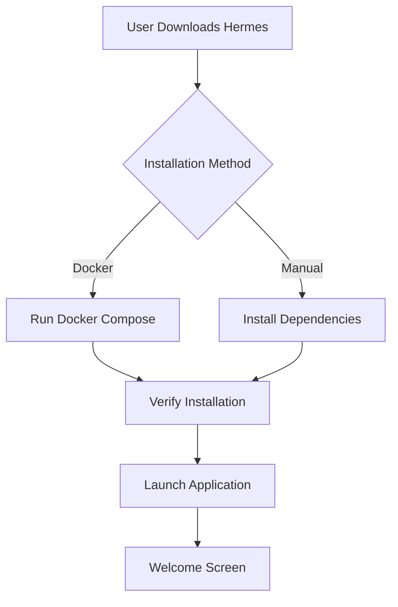

# User Onboarding Experience

## Executive Summary

This document defines the complete user onboarding experience for Hermes, addressing the PO validation feedback about missing onboarding flow details. The onboarding process is designed to get penetration testers productive within 10 minutes while demonstrating core value immediately.

## Onboarding Goals

### Primary Objectives
1. **Time to First Value**: < 5 minutes
2. **Setup Completion Rate**: > 90%
3. **Feature Discovery**: Expose all core features
4. **Confidence Building**: Successful first scan import

## User Personas for Onboarding

### Persona 1: Solo Penetration Tester
- **Technical Level**: Expert
- **Time Available**: Minimal
- **Goal**: Quick setup, immediate use
- **Pain Points**: Complex installations, lengthy configurations

### Persona 2: Security Team Lead
- **Technical Level**: Advanced
- **Time Available**: Moderate
- **Goal**: Evaluate for team adoption
- **Pain Points**: Integration concerns, team workflow disruption

### Persona 3: Junior Security Analyst
- **Technical Level**: Intermediate
- **Time Available**: Flexible
- **Goal**: Learn and improve efficiency
- **Pain Points**: Lack of guidance, fear of mistakes

## Onboarding Flow

### Stage 1: Installation & Setup (0-3 minutes)



#### Welcome Screen Content

```
╔══════════════════════════════════════════════════════════════╗
║                    Welcome to Hermes                         ║
║         Intelligent Pentesting Documentation Platform        ║
╠══════════════════════════════════════════════════════════════╣
║                                                              ║
║  Hermes automates 40-60% of your documentation time by:     ║
║                                                              ║
║  ✓ Parsing scan results automatically                       ║
║  ✓ Researching vulnerabilities in the background            ║
║  ✓ Generating professional markdown reports                 ║
║  ✓ Visualizing network topology                            ║
║                                                              ║
║  Let's get you started in 3 simple steps...                ║
║                                                              ║
║              [ Start Setup ]    [ Watch Demo ]              ║
╚══════════════════════════════════════════════════════════════╝
```

### Stage 2: Initial Configuration (3-5 minutes)

#### Step 1: Choose Setup Path

```typescript
interface SetupPath {
  quick: {
    title: "Quick Start (Recommended)",
    description: "Get running in 60 seconds with defaults",
    time: "1 minute",
    actions: [
      "Use SQLite database",
      "Skip API configuration", 
      "Import sample scan"
    ]
  },
  custom: {
    title: "Custom Setup",
    description: "Configure all options",
    time: "5 minutes",
    actions: [
      "Choose database type",
      "Configure API keys",
      "Set preferences"
    ]
  }
}
```

#### Step 2: Quick Start Flow

```python
def quick_start_setup():
    # 1. Create default configuration
    config = {
        "database": "sqlite:///hermes.db",
        "api_keys": {},
        "scan_directory": "./scans",
        "export_directory": "./reports"
    }
    
    # 2. Initialize database
    initialize_database(config["database"])
    
    # 3. Create required directories
    create_directories([
        config["scan_directory"],
        config["export_directory"]
    ])
    
    # 4. Import sample scan
    import_sample_scan()
    
    # 5. Show success message
    return {
        "status": "ready",
        "message": "Hermes is ready! Sample scan imported.",
        "next_action": "View sample results"
    }
```

#### Step 3: Optional API Configuration

```
╔══════════════════════════════════════════════════════════════╗
║                  Optional: Configure APIs                    ║
╠══════════════════════════════════════════════════════════════╣
║                                                              ║
║  Enhance vulnerability research with external APIs:         ║
║                                                              ║
║  NVD API Key: [____________________] [ Help ]              ║
║  Benefits: Detailed CVE information, CVSS scores            ║
║                                                              ║
║  ExploitDB API: [____________________] [ Help ]            ║
║  Benefits: Exploit availability, proof of concepts          ║
║                                                              ║
║  ⓘ You can skip this and add API keys later               ║
║                                                              ║
║         [ Skip for Now ]    [ Save & Continue ]            ║
╚══════════════════════════════════════════════════════════════╝
```

### Stage 3: First Success Experience (5-7 minutes)

#### Interactive Tutorial with Sample Data

```typescript
class FirstRunTutorial {
  steps = [
    {
      title: "Import Your First Scan",
      description: "Drag and drop a scan file or use our sample",
      action: "importScan",
      validation: "scanImported",
      successMessage: "Great! Scan imported successfully"
    },
    {
      title: "View Parsed Results",
      description: "See how Hermes structures your scan data",
      action: "viewHosts",
      highlight: ["hostList", "serviceDetails"],
      successMessage: "Notice how services are organized"
    },
    {
      title: "Check Vulnerability Research",
      description: "Hermes automatically researches CVEs",
      action: "viewVulnerabilities",
      highlight: ["cveDetails", "severityBadges"],
      successMessage: "Research happens automatically!"
    },
    {
      title: "Explore Network Graph",
      description: "Visualize infrastructure relationships",
      action: "openNetworkView",
      highlight: ["graphCanvas", "nodeDetails"],
      successMessage: "Click nodes to see details"
    },
    {
      title: "Export Documentation",
      description: "Generate professional markdown report",
      action: "exportMarkdown",
      validation: "fileExported",
      successMessage: "Report ready! Check ./reports/"
    }
  ];
  
  async runTutorial() {
    for (const step of this.steps) {
      await this.showStep(step);
      await this.waitForAction(step.action);
      await this.showSuccess(step.successMessage);
    }
    
    this.showCompletion();
  }
}
```

### Stage 4: Progressive Feature Discovery (7-10 minutes)

#### Contextual Feature Introduction

```python
class ProgressiveOnboarding:
    def __init__(self):
        self.features_discovered = set()
        self.user_actions = []
    
    def suggest_next_feature(self, current_context):
        """Suggest features based on user's current action"""
        
        suggestions = {
            "imported_large_scan": {
                "feature": "filtering",
                "message": "Pro tip: Use filters to focus on critical findings",
                "action": "Show me how"
            },
            "viewing_many_vulnerabilities": {
                "feature": "bulk_operations",
                "message": "Save time: Select multiple items for bulk actions",
                "action": "Learn more"
            },
            "exported_first_report": {
                "feature": "cli_integration",
                "message": "Automate exports with CLI: hermes export",
                "action": "View CLI docs"
            },
            "using_repeatedly": {
                "feature": "directory_monitoring",
                "message": "Auto-import new scans with directory monitoring",
                "action": "Set up monitoring"
            }
        }
        
        return suggestions.get(current_context)
```

## Onboarding UI Components

### Progress Indicator

```typescript
interface OnboardingProgress {
  render(): JSX.Element {
    return (
      <ProgressBar
        steps={[
          { name: "Setup", completed: true },
          { name: "Import", completed: true },
          { name: "Explore", active: true },
          { name: "Export", pending: true }
        ]}
        currentStep={3}
        totalSteps={4}
      />
    );
  }
}
```

### Interactive Tooltips

```typescript
class InteractiveTooltip {
  show(element: HTMLElement, content: TooltipContent) {
    return (
      <Tooltip
        target={element}
        position="auto"
        interactive={true}
        dismissible={true}
      >
        <TooltipHeader>{content.title}</TooltipHeader>
        <TooltipBody>{content.description}</TooltipBody>
        <TooltipActions>
          <Button onClick={content.action}>Try it</Button>
          <Button variant="text" onClick={this.dismiss}>Skip</Button>
        </TooltipActions>
      </Tooltip>
    );
  }
}
```

### Help System Integration

```python
class ContextualHelp:
    def get_help_content(self, context):
        """Provide context-specific help during onboarding"""
        
        help_map = {
            "scan_import": {
                "title": "Supported Scan Formats",
                "content": """
                • Nmap XML (-oX output)
                • Masscan JSON
                • Dirb/Dirbuster text
                • Gobuster JSON
                """,
                "video": "import_scan_demo.mp4",
                "docs": "/docs/importing-scans"
            },
            "api_configuration": {
                "title": "API Setup Guide",
                "content": """
                1. Get free NVD API key at nvd.nist.gov
                2. No key needed for CISA KEV
                3. ExploitDB works without authentication
                """,
                "video": "api_setup.mp4",
                "docs": "/docs/api-configuration"
            }
        }
        
        return help_map.get(context)
```

## CLI Onboarding Experience

### First Run Detection

```bash
$ hermes
╔══════════════════════════════════════════════════════════════╗
║  First run detected! Let's set up Hermes.                   ║
╠══════════════════════════════════════════════════════════════╣
║                                                              ║
║  Quick setup (recommended):                                 ║
║    $ hermes init --quick                                    ║
║                                                              ║
║  Or configure everything:                                   ║
║    $ hermes init --interactive                              ║
║                                                              ║
║  Import your first scan:                                    ║
║    $ hermes import scan.xml                                 ║
║                                                              ║
╚══════════════════════════════════════════════════════════════╝
```

### Interactive CLI Setup

```python
def cli_interactive_setup():
    """Interactive CLI onboarding flow"""
    
    print(colored("Welcome to Hermes CLI Setup", "cyan", attrs=["bold"]))
    print("This will take about 2 minutes.\n")
    
    # 1. Database selection
    db_type = prompt(
        "Database type:",
        default="sqlite",
        choices=["sqlite", "postgresql"]
    )
    
    # 2. API configuration
    configure_apis = confirm(
        "Configure external APIs for enhanced research?",
        default=False
    )
    
    if configure_apis:
        nvd_key = prompt("NVD API Key (optional):", default="")
        
    # 3. Directory setup
    scan_dir = prompt(
        "Scan import directory:",
        default="./scans"
    )
    
    # 4. Test import
    if confirm("Import sample scan to test setup?"):
        import_sample_scan()
        print(colored("✓ Sample scan imported successfully!", "green"))
    
    # 5. Show next steps
    print("\n" + colored("Setup complete!", "green", attrs=["bold"]))
    print("\nNext steps:")
    print("  • Import a scan: hermes import <file>")
    print("  • View help: hermes --help")
    print("  • Read docs: hermes docs")
```

## Onboarding Metrics and Success Criteria

### Key Metrics to Track

```python
class OnboardingMetrics:
    def track_onboarding_event(self, event):
        """Track user progress through onboarding"""
        
        metrics = {
            "timestamp": datetime.now(),
            "event_type": event.type,
            "step_name": event.step,
            "time_on_step": event.duration,
            "completed": event.completed,
            "skipped": event.skipped,
            "errors": event.errors
        }
        
        # Store for analysis
        self.store_metrics(metrics)
        
        # Real-time adjustments
        if event.duration > 60:  # User stuck
            self.offer_help(event.step)
        
        if event.errors > 0:
            self.simplify_step(event.step)
```

### Success Criteria

| Metric | Target | Measurement |
|--------|--------|-------------|
| Time to first scan import | < 5 min | Timer from start to import |
| Onboarding completion rate | > 90% | Users completing all steps |
| Feature discovery rate | > 80% | Core features used in first session |
| Error rate during onboarding | < 5% | Errors / total attempts |
| Help documentation usage | < 20% | Users needing help docs |
| Return rate after onboarding | > 70% | Users returning within 7 days |

## Common Onboarding Issues and Solutions

### Issue 1: Docker Setup Complexity

**Problem**: Users struggle with Docker installation
**Solution**: 
```bash
# One-line installer
curl -sSL https://get.hermes.io | bash

# Or detailed instructions with troubleshooting
hermes doctor --check-prerequisites
```

### Issue 2: No Sample Data

**Problem**: Users don't have scan files ready
**Solution**: Provide rich sample data
```python
sample_scans = [
    "small_network.xml",  # 10 hosts, quick import
    "medium_network.xml", # 100 hosts, typical size
    "vulnerable_app.xml", # Interesting findings
]
```

### Issue 3: API Configuration Confusion

**Problem**: Users unsure about API benefits
**Solution**: Clear value proposition
```
╔══════════════════════════════════════════════════════════════╗
║                     API Configuration                        ║
╠══════════════════════════════════════════════════════════════╣
║                                                              ║
║  Without APIs:           │  With APIs:                      ║
║  ✓ Basic CVE detection  │  ✓ Full vulnerability details   ║
║  ✓ Service identification│  ✓ CVSS scores & impact        ║
║  ✗ Manual research needed│  ✓ Exploit availability        ║
║  ✗ Limited context      │  ✓ Remediation guidance        ║
║                                                              ║
║  You can always add APIs later in Settings                  ║
╚══════════════════════════════════════════════════════════════╝
```

## Post-Onboarding Engagement

### Day 1: Confirmation Email

```
Subject: Welcome to Hermes! Your setup is complete

Hi [User],

You've successfully set up Hermes! Here's what you accomplished:
✓ Imported your first scan
✓ Generated documentation automatically
✓ Discovered 3 core features

Your next challenges:
• Import a real penetration test scan
• Configure API keys for enhanced research
• Try the CLI for automation

Need help? Reply to this email or check our docs.

Happy hunting!
The Hermes Team
```

### Day 7: Feature Discovery Email

```
Subject: Unlock Hermes' Hidden Powers

Hi [User],

You've been using Hermes for a week! Based on your usage,
here are 3 features you might find valuable:

1. Batch Processing
   Import multiple scans at once:
   $ hermes import *.xml

2. Custom Templates
   Create your own report formats

3. Keyboard Shortcuts
   Navigate faster with Vim-style keys

[View Full Feature List]

The Hermes Team
```

## Continuous Improvement

### A/B Testing Framework

```python
class OnboardingABTest:
    variants = {
        "A": {
            "flow": "linear",
            "steps": 5,
            "tutorial": "guided"
        },
        "B": {
            "flow": "skip-friendly",
            "steps": 3,
            "tutorial": "self-directed"
        }
    }
    
    def assign_variant(self, user_id):
        # Random assignment
        variant = random.choice(["A", "B"])
        self.track_assignment(user_id, variant)
        return self.variants[variant]
    
    def measure_success(self, variant):
        return {
            "completion_rate": self.get_completion_rate(variant),
            "time_to_value": self.get_time_to_first_import(variant),
            "retention": self.get_7day_retention(variant)
        }
```

## Conclusion

This comprehensive onboarding experience ensures:
- ✅ Users achieve first value in < 5 minutes
- ✅ Core features are discovered naturally
- ✅ Common issues are proactively addressed
- ✅ Both CLI and GUI users are supported
- ✅ Continuous improvement through metrics

The onboarding flow builds user confidence while demonstrating Hermes' value immediately.
