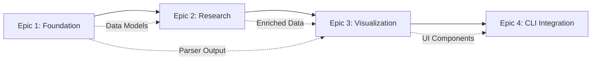

# Hermes User Stories Documentation

## Executive Summary

This document provides a comprehensive breakdown of user stories derived from the four main epics, with explicit dependency management, refined MVP scope, and clear execution sequencing. These stories address the critical feedback from the PO validation, ensuring proper cross-epic dependencies and focused MVP delivery.

## Epic Execution Sequence & Dependencies

### Dependency Chain: Epic 1 → Epic 2 → Epic 3 → Epic 4



### Critical Path Analysis

1. **Epic 1** must complete first - provides core data models, parsing infrastructure
2. **Epic 2** depends on Epic 1's data structures for vulnerability enrichment
3. **Epic 3** requires data from Epic 1 & 2 for meaningful visualization
4. **Epic 4** integrates all previous components into CLI workflows

## Epic 1: Foundation & Core Intelligence Engine

### Story Breakdown with Dependencies

#### US-1.1: Project Infrastructure Setup
**Priority:** P0 (Blocker)
**Dependencies:** None (Starting point)
**Estimation:** 3 story points

**User Story:**
As a **developer**, I want **complete project scaffolding with Docker containerization** so that **the development environment supports all planned services**.

**Acceptance Criteria:**
- [ ] Monorepo structure created with backend/, frontend/, cli/, shared/ directories
- [ ] Docker Compose configuration for all services (FastAPI, React, Redis, PostgreSQL)
- [ ] SQLite database connection for development environment
- [ ] Basic FastAPI health check endpoint returning JSON
- [ ] React TypeScript app with "Hello Hermes" and Tailwind CSS
- [ ] Single `docker-compose up` starts all services

**Technical Tasks:**
1. Initialize monorepo with proper .gitignore
2. Create Docker configurations for each service
3. Set up docker-compose.yml with service dependencies
4. Configure environment variables and .env.example
5. Create basic CI/CD pipeline configuration

---

#### US-1.2: Core Data Models and Schema
**Priority:** P0 (Blocker)
**Dependencies:** US-1.1
**Estimation:** 5 story points

**User Story:**
As a **developer**, I want **database schema for hosts, services, and vulnerabilities** so that **parsed scan data can be persisted efficiently**.

**Acceptance Criteria:**
- [ ] Host model with IP, hostname, OS detection, scan metadata
- [ ] Service model with port, protocol, service name, version, banner
- [ ] Vulnerability model with CVE, severity, description, research status
- [ ] Scan model tracking source file, timestamp, tool type, status
- [ ] SQLAlchemy models with proper relationships
- [ ] Alembic migrations configured and applied
- [ ] Basic CRUD operations via FastAPI endpoints

**Technical Tasks:**
1. Design database schema with proper normalization
2. Implement SQLAlchemy models
3. Create Alembic migration scripts
4. Build repository pattern for data access
5. Create FastAPI CRUD endpoints
6. Write unit tests for models and repositories

---

#### US-1.3: Nmap XML Parser (MVP Core)
**Priority:** P0 (Blocker)
**Dependencies:** US-1.2
**Estimation:** 8 story points

**User Story:**
As a **penetration tester**, I want **automatic parsing of nmap XML files** so that **I get structured documentation without manual processing**.

**Acceptance Criteria:**
- [ ] Extract host information (IP, hostname, OS) from nmap XML
- [ ] Capture all service details (port, protocol, service, version, banner)
- [ ] Handle 1000+ hosts without memory errors
- [ ] Detect and report corrupted XML with clear errors
- [ ] Store parsed data with proper relationships
- [ ] Process 100 hosts in under 5 seconds
- [ ] Maintain audit trail of scan source and timestamp

**Technical Tasks:**
1. Implement XML parsing with error handling
2. Create data extraction logic for hosts/services
3. Build database insertion with transaction support
4. Add performance optimization for large files
5. Implement duplicate detection logic
6. Create comprehensive test suite with sample files

---

#### US-1.4: Basic Markdown Documentation Generator
**Priority:** P1 (Critical)
**Dependencies:** US-1.3
**Estimation:** 5 story points

**User Story:**
As a **penetration tester**, I want **automatic markdown generation from parsed data** so that **I have readable documentation immediately**.

**Acceptance Criteria:**
- [ ] Generate GitHub-flavored markdown with headers, tables, code blocks
- [ ] Host sections with collapsible service details
- [ ] Service information in readable tables
- [ ] Code blocks preserve banner information
- [ ] Include metadata section with scan info and statistics
- [ ] Valid markdown syntax that renders correctly
- [ ] Generate docs for 500+ hosts in under 10 seconds

**Technical Tasks:**
1. Create markdown template engine
2. Implement host/service formatting logic
3. Add collapsible section generation
4. Build export functionality
5. Optimize for large datasets
6. Add markdown validation

## Epic 2: Vulnerability Research & Data Integration

### Story Breakdown with Dependencies

#### US-2.1: Service Version Analysis
**Priority:** P1 (Critical)
**Dependencies:** US-1.3 (Parser output)
**Estimation:** 8 story points

**User Story:**
As a **penetration tester**, I want **automatic vulnerability detection from service versions** so that **potential issues are identified without manual analysis**.

**Acceptance Criteria:**
- [ ] Extract software versions from service banners
- [ ] Compare against known vulnerable version ranges
- [ ] Detect default credential indicators
- [ ] Provide confidence scoring (high/medium/low)
- [ ] Create manual review queue for uncertain matches
- [ ] Keep false positive rate under 10%
- [ ] Complete analysis within 3 seconds per service

**Technical Tasks:**
1. Build version extraction regex patterns
2. Create vulnerability database schema
3. Implement version comparison logic
4. Add confidence scoring algorithm
5. Build manual review interface
6. Create test suite with known vulnerabilities

---

#### US-2.2: API Configuration Infrastructure
**Priority:** P1 (Critical)
**Dependencies:** US-1.1 (Infrastructure)
**Estimation:** 5 story points

**User Story:**
As a **system administrator**, I want **secure API key management** so that **external integrations are reliable and secure**.

**Acceptance Criteria:**
- [ ] Secure storage using OS keyring services
- [ ] Configurable rate limiting framework
- [ ] Error handling for API failures and timeouts
- [ ] User interface for enabling/disabling APIs
- [ ] Fallback mechanisms when APIs unavailable
- [ ] API usage monitoring and reporting
- [ ] Background job monitoring with retry logic

**Technical Tasks:**
1. Implement keyring integration
2. Build rate limiting middleware
3. Create API configuration interface
4. Add monitoring and metrics collection
5. Implement retry and fallback logic
6. Create API health check system

---

#### US-2.3: NVD Integration (Simplified for MVP)
**Priority:** P2 (Important)
**Dependencies:** US-2.2, US-2.1
**Estimation:** 8 story points

**User Story:**
As a **penetration tester**, I want **automated CVE research** so that **I have vulnerability details without manual lookups**.

**MVP Scope Reduction:**
- Focus on basic CVE lookup only
- Defer advanced correlation features
- Provide manual research links as primary fallback

**Acceptance Criteria:**
- [ ] NVD API v2.0 integration with rate limiting
- [ ] Redis caching with 24-hour TTL
- [ ] Background processing via Celery
- [ ] Include CVE description and CVSS score
- [ ] Generate manual research links when API unavailable
- [ ] Complete research within 60 seconds
- [ ] Clear indication of data source

**Technical Tasks:**
1. Implement NVD API client
2. Set up Redis caching layer
3. Configure Celery workers
4. Build fallback link generation
5. Add result aggregation logic
6. Create integration tests

## Epic 3: Network Visualization & Professional Interface (MVP Simplified)

### Story Breakdown with Dependencies

#### US-3.1: Basic Network Graph (MVP Version)
**Priority:** P2 (Important)
**Dependencies:** US-1.3, US-2.1 (Requires parsed and enriched data)
**Estimation:** 13 story points

**User Story:**
As a **penetration tester**, I want **simple network topology visualization** so that **I can understand infrastructure relationships visually**.

**MVP Scope Reduction:**
- Basic force-directed graph only
- Limit to 100 nodes for MVP
- Defer advanced filtering to post-MVP
- Simple color coding by severity only

**Acceptance Criteria:**
- [ ] Generate nodes for discovered hosts
- [ ] Show service connections to hosts
- [ ] Force-directed layout with minimal overlap
- [ ] Support up to 100 nodes (reduced from 500)
- [ ] Basic color coding for vulnerability severity
- [ ] Render within 2 seconds
- [ ] Export as static image only (PNG)

**Technical Tasks:**
1. Implement D3.js graph generation
2. Create force-directed layout algorithm
3. Add basic node/edge rendering
4. Implement severity color coding
5. Add PNG export functionality
6. Optimize rendering performance

---

#### US-3.2: Minimal Interactive Controls
**Priority:** P3 (Nice to have)
**Dependencies:** US-3.1
**Estimation:** 5 story points

**User Story:**
As a **penetration tester**, I want **basic zoom and pan controls** so that **I can navigate the network graph**.

**MVP Scope:**
- Mouse wheel zoom only
- Click-and-drag panning
- Single node selection
- Defer multi-select and keyboard shortcuts

**Acceptance Criteria:**
- [ ] Mouse wheel zoom with smooth scaling
- [ ] Click-and-drag panning
- [ ] Single node selection shows basic info
- [ ] Fit-to-screen button
- [ ] Touch-friendly for tablets

---

#### US-3.3: Simple Three-Panel Layout
**Priority:** P2 (Important)
**Dependencies:** US-3.1
**Estimation:** 8 story points

**User Story:**
As a **penetration tester**, I want **organized three-panel interface** so that **I can access all information efficiently**.

**MVP Scope:**
- Fixed panel widths for MVP
- Basic dark theme only
- Defer customization features

**Acceptance Criteria:**
- [ ] Left sidebar (200px) with navigation
- [ ] Center workspace for graph display
- [ ] Right sidebar (300px) for details
- [ ] Responsive collapse at 1200px
- [ ] Professional dark theme
- [ ] Basic state persistence

## Epic 4: CLI Integration & Workflow Automation

### Story Breakdown with Dependencies

#### US-4.1: Core CLI Tool (MVP Essential)
**Priority:** P1 (Critical)
**Dependencies:** US-1.3, US-1.4, US-2.1
**Estimation:** 8 story points

**User Story:**
As a **penetration tester**, I want **command-line interface for scan import** so that **I can integrate Hermes into my terminal workflow**.

**MVP Scope:**
- Focus on import and export commands only
- Defer advanced features like piping
- Basic configuration management

**Acceptance Criteria:**
- [ ] `hermes import <file>` processes scan files
- [ ] `hermes export` generates markdown
- [ ] `hermes config` manages API keys
- [ ] Comprehensive help system
- [ ] Unix-style exit codes
- [ ] Clear error messages

**Technical Tasks:**
1. Implement Click CLI framework
2. Create import command logic
3. Build export functionality
4. Add configuration management
5. Write help documentation
6. Create integration tests

---

#### US-4.2: Directory Monitoring (Post-MVP)
**Priority:** P3 (Nice to have)
**Dependencies:** US-4.1
**Estimation:** 8 story points
**Status:** DEFERRED TO POST-MVP

---

#### US-4.3: Tool Integration (Post-MVP)
**Priority:** P3 (Nice to have)
**Dependencies:** US-4.1
**Estimation:** 13 story points
**Status:** DEFERRED TO POST-MVP

## Cross-Epic Integration Points

### Data Flow Dependencies

```yaml
integration_points:
  epic_1_to_2:
    - parsed_scan_data: "Epic 1 provides structured data for Epic 2 enrichment"
    - data_models: "Epic 2 extends Epic 1 models with vulnerability fields"
    
  epic_2_to_3:
    - enriched_data: "Epic 3 visualizes Epic 2's vulnerability research"
    - severity_scores: "Epic 3 uses Epic 2's CVSS for color coding"
    
  epic_3_to_4:
    - ui_components: "Epic 4 may reuse Epic 3's display logic"
    - export_formats: "Epic 4 leverages Epic 3's export capabilities"
```

### Technical Integration Requirements

1. **Shared Data Models** (Epic 1 → All)
   - Common SQLAlchemy models
   - Consistent API contracts
   - Shared validation logic

2. **Service Communication** (Epic 2 → 3)
   - WebSocket updates for research progress
   - Event-driven architecture for real-time updates

3. **Export Pipeline** (Epic 3 → 4)
   - Common export service
   - Shared formatting logic

## MVP Scope Refinement

### Core MVP Features (Must Have)

1. **Epic 1**: All stories (US-1.1 through US-1.4)
2. **Epic 2**: US-2.1, US-2.2, US-2.3 (simplified)
3. **Epic 3**: US-3.1 (simplified), US-3.3
4. **Epic 4**: US-4.1 only

### Deferred to Post-MVP

1. **Advanced Visualization**: 500-node support, complex filtering
2. **Multiple Export Formats**: SVG, advanced layouts
3. **CLI Advanced Features**: Piping, directory monitoring
4. **Complex Integrations**: Tool wrappers, batch processing

### Simplifications for MVP

1. **Network Graph**: 100 nodes max (vs 500)
2. **Export**: PNG only (vs SVG + PNG)
3. **CLI**: Basic import/export (vs full pipeline)
4. **Research**: Manual links primary (vs full automation)

## Risk Mitigation Strategies

### Technical Risks

1. **Performance at Scale**
   - Mitigation: Start with 100-node limit, optimize later
   - Fallback: Pagination and filtering

2. **API Rate Limits**
   - Mitigation: Aggressive caching, manual link fallbacks
   - Fallback: Offline mode with manual research

3. **Cross-Epic Integration**
   - Mitigation: Clear API contracts, integration tests
   - Fallback: Modular design allows independent operation

### Schedule Risks

1. **Scope Creep**
   - Mitigation: Strict MVP scope enforcement
   - Regular scope reviews

2. **Dependency Delays**
   - Mitigation: Sequential epic execution
   - Buffer time between epics

## Success Metrics

### MVP Launch Criteria

- [ ] Parse nmap scans and generate markdown (Epic 1)
- [ ] Basic vulnerability detection working (Epic 2)
- [ ] Simple network graph displays (Epic 3)
- [ ] CLI import/export functional (Epic 4)
- [ ] Performance: 100-host scan in 15 seconds
- [ ] Error rate below 2%

### Post-MVP Roadmap

1. **Phase 2**: Advanced visualization, full CLI integration
2. **Phase 3**: Team collaboration features
3. **Phase 4**: Enterprise features, API marketplace

## Conclusion

This user story breakdown addresses all critical feedback from the PO validation:
- ✅ Explicit cross-epic dependencies defined
- ✅ Sequential execution chain established
- ✅ MVP scope simplified and focused
- ✅ Clear integration points documented
- ✅ Risk mitigation strategies in place

The project is now ready for development with clear priorities and dependencies.
